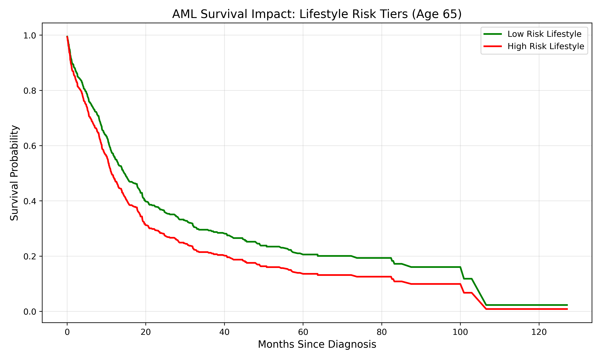

# Leukemia Survival Analysis: The Intersection of Age & Lifestyle

## 📌 Project Overview
This project investigates how biological age and lifestyle-driven risk factors influence the survival rates of patients with **Acute Myeloid Leukemia (AML)**. By merging clinical data from **cBioPortal (TCGA)** with lifestyle proxies derived from **NHANES**, the model provides a holistic view of patient prognosis beyond traditional clinical markers.

## 📊 Data Sources
* **Clinical Data:** Acute Myeloid Leukemia (TCGA, PanCancer Atlas) via cBioPortal, focusing on age, sex, and overall survival (OS).
* **Lifestyle Data:** National Health and Nutrition Examination Survey (NHANES) used to derive risk scores for BMI, smoking status, and sedentary behavior.

## 🛠 Methodology & Technical Solves
* **Statistical Merging:** Mapped NHANES lifestyle probabilities onto clinical cancer records using sex and age-decades to reduce linear redundancy.
* **Feature Engineering:** Developed a `high_lifestyle_risk` binary classifier to resolve high multicollinearity (VIF) issues.
* **Survival Modeling:** Implemented a **Cox Proportional Hazards Model** to handle censored data and calculate hazard ratios.
* **Optimization:** Successfully reduced Variable Inflation Factor (VIF) for primary features from **39.1 to 1.2**, ensuring the statistical independence of predictors.

## 📈 Key Findings
* **Age Dominance:** Age remains the primary predictor of OS in AML, with a hazard ratio indicating a ~3% increase in risk per year.
* **Lifestyle Impact:** By categorizing lifestyle risks, the model isolates the survival gap between "High" and "Low" risk behaviors independently of the patient's biological age.

* **Predictive Accuracy:** The model maintains a **Concordance Index of 0.67**, providing reliable survival probability estimates at 12, 24, and 60-month milestones.

## 🚀 How to Use
1. Run `merge_data.py` to process and align datasets.
2. Use the `predict_patient_survival()` function to input age and lifestyle metrics.

3. Generate survival curves to visualize the prognosis gap across different risk tiers.

