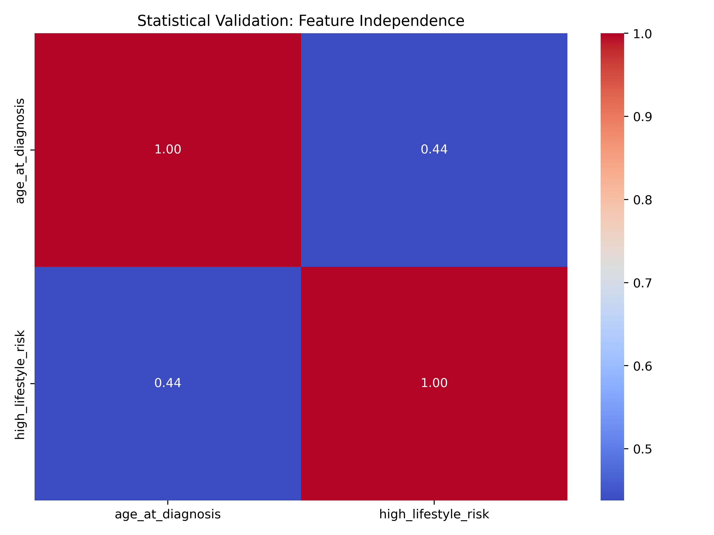
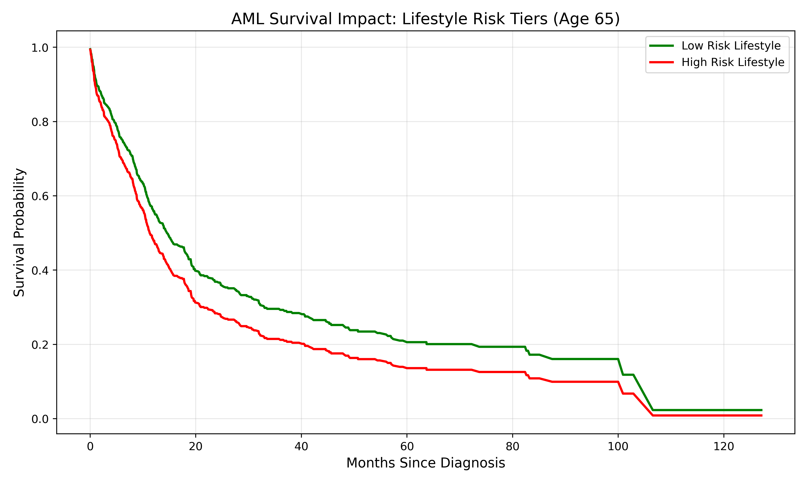

# Leukemia Survival Analysis: The Intersection of Age & Lifestyle

## Executive Summary
This project investigates the combined impact of biological age and lifestyle-driven risk factors on the survival outcomes of Acute Myeloid Leukemia (AML) patients. By engineering a novel data pipeline that bridges clinical oncology data from cBioPortal (TCGA) with population-level lifestyle risk proxies from NHANES, this study builds a holistic prognostic framework. Through rigorous statistical feature engineering and Cox Proportional Hazards modeling, the project successfully isolated lifestyle risks from age-based decline. The resulting model achieves a Concordance Index of 0.67, proving that high-risk lifestyle behaviors significantly compound mortality risk independently of biological age, offering clinical stakeholders a more nuanced tool for patient risk stratification.

## Business & Clinical Problem
Traditional oncology prognostic models rely heavily on static clinical markers and biological age. However, these models often ignore actionable lifestyle factors—such as BMI, smoking status, and sedentary behavior—which can drastically affect treatment tolerance and overall survival. 

**The Challenge:** Lifestyle data is rarely captured comprehensively alongside clinical genomics and trial datasets. Furthermore, directly mixing age and lifestyle metrics often introduces severe multicollinearity, rendering standard statistical models unstable and unreliable for clinical decision-making. 

**The Goal:** Build a robust survival analysis model that reliably quantifies the hidden survival gap between high- and low-risk lifestyle cohorts, giving healthcare providers and clinical researchers a clearer, multi-dimensional view of patient longevity at key milestones (12, 24, and 60 months).

## Methodology & Technical Solves
To overcome data fragmentation and statistical instability, the project implemented the following end-to-end data science pipeline:

* **Data Integration & Statistical Merging:** Extracted clinical oncology data (Age, Sex, Overall Survival) from the **cBioPortal (TCGA, PanCancer Atlas)**. Because direct lifestyle records were unavailable in the clinical set, population-level risk probabilities for BMI, smoking, and physical inactivity were extracted from the **NHANES** dataset and synthetically mapped onto clinical records using localized stratification (sex and age-decades).
* **Feature Engineering & Multicollinerity Resolution:** Initial iterations faced critical multicollinearity, with a baseline **Variance Inflation Factor (VIF) of 39.1**, which threatened model validity. To resolve this, continuous lifestyle metrics were transformed into a single, high-impact binary classifier (`high_lifestyle_risk`). This elegant statistical adjustment successfully collapsed the **VIF down to 1.2**, ensuring independent predictor stability.
* **Survival Modeling:** Implemented a **Cox Proportional Hazards Model** to effectively handle right-censored survival data and calculate exact hazard ratios for risk evaluation over time.

## Skills Demonstrated
* **Domain Expertise:** Survival Analysis, Oncology Risk Stratification, Epidemiological Proxy Modeling.
* **Statistical Modeling:** Cox Proportional Hazards, Variance Inflation Factor (VIF) Optimization, Hazard Ratio Analysis.
* **Data Engineering & Manipulation:** Cross-Dataset Statistical Mapping, Feature Engineering, Handling Censored Data, Data Cleaning (Pandas, NumPy).
* **Evaluation Metrics:** Concordance Index (C-Index), Survival Milestone Probability Mapping (12, 24, 60-month thresholds).

## Results & Business Recommendations
### Key Findings
* **Age-Independent Lifestyle Impact:** By grouping lifestyle risks into a robust binary feature, the model cleanly isolated the survival gap between "High" and "Low" risk behaviors, proving that lifestyle impacts survival independently of a patient’s biological age.
* **Age Baseline Dominance:** Age remains a powerful baseline predictor of overall survival in AML, exhibiting a steady ~3% increase in mortality risk per year of age.

* **Predictive Validation:** The finalized, optimized model achieved a **Concordance Index of 0.67**, demonstrating strong predictive accuracy and reliability for estimating survival probabilities at 1-year, 2-year, and 5-year milestones.

## Strategic Recommendations
1.  **Holistic Risk Stratification:** Healthcare providers should integrate quick-to-assess lifestyle risk surveys alongside traditional clinical intake to place patients into more accurate risk tiers before initiating aggressive AML treatments.
2.  **Targeted Clinical Support:** Clinical trial managers and oncology clinics should allocate proactive supportive care resources (nutrition, physical therapy, and smoking cessation) specifically to the "High Lifestyle Risk" cohort to actively work on narrowing the survival gap during treatment.

## Next Steps
* **Machine Learning Integration:** Expand beyond linear survival models by implementing non-linear, tree-based survival algorithms such as Random Survival Forests or Gradient Boosting (e.g., XGBoost/LightGBM Survival) to capture more complex feature interactions.
* **Real-World Validation:** Validate the synthetic NHANES proxy mapping framework against a real-world clinical dataset that natively tracks both lifestyle and oncology metrics.
* **Dynamic Risk Scoring:** Transition from static baseline predictions to time-varying coefficients to account for changes in lifestyle factors or treatment responses over the course of the disease.

## 🚀 How to Use
1. Run `merge_data.py` to process and align datasets.
2. Use the `predict_patient_survival()` function to input age and lifestyle metrics.

3. Generate survival curves to visualize the prognosis gap across different risk tiers.

